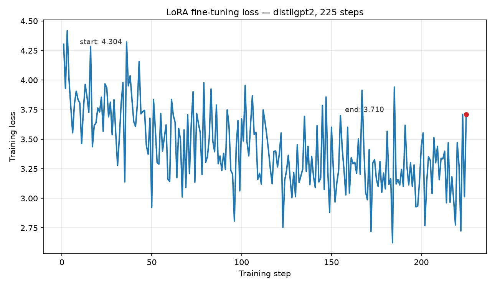

# LLM Fine-Tuning Workflow

A reproducible instruction fine-tuning pipeline for small language models: data preparation, parameter-efficient (LoRA) training, evaluation, and local inference. Built to run entirely on a laptop CPU — no GPU required.

## What it does

The pipeline fine-tunes a small GPT-2-family model on instruction/response pairs using **LoRA** (Low-Rank Adaptation), so only a small fraction of the parameters are trained. It is designed to scale up: swap the model name in a config to train a larger model on more data, or add a GPU and it uses it automatically.

- **Data prep** — samples `databricks/databricks-dolly-15k` (CC-BY-SA-3.0), formats examples into an instruction prompt template, and splits train/validation deterministically.
- **Training** — config-driven LoRA fine-tune via the Hugging Face Trainer, with a validated YAML config so runs are reproducible.
- **Evaluation** — validation loss and perplexity before vs after fine-tuning, plus sample generations.
- **Inference** — load the saved adapter and generate responses locally (`scripts/run_inference.py`).

## Results (this repo's run)

Fine-tuned `distilgpt2` (82M params) on 900 instruction examples (1 epoch, LoRA r=8) on CPU:

| Metric | Baseline | After fine-tuning |
|---|---|---|
| Validation loss | 3.72 | **3.13** |
| Perplexity | 41.4 | **22.8** (−45%) |
| Trainable parameters | — | 221 K of 82 M total (~0.3%) |

[](docs/loss_curve.csv)

The model went from near-chance output to generating plausible, on-topic responses (with some repetition — expected from a small model). Sample generations and exact metrics: `outputs/generated_samples.json` and `outputs/train_metrics.json` (generated by the scripts, not committed). The per-step loss curve behind the chart is committed at `docs/loss_curve.csv` and regenerated by `scripts/make_loss_chart.py`.

## Quick start

```bash
python -m venv .venv && source .venv/bin/activate

# CPU-only torch (smaller download); or just `pip install -e ".[train]"` for GPU
pip install torch --index-url https://download.pytorch.org/whl/cpu
pip install -e ".[train,dev]"

# 1. Download + prepare the data (writes to data/raw/, gitignored)
python scripts/prepare_data.py --max-examples 1000

# 2. Train (smoke config for a fast check, default for the real run)
python scripts/run_train.py configs/smoke.yaml
python scripts/run_train.py configs/default.yaml

# 3. Evaluate: perplexity + generated samples
python scripts/run_evaluate.py configs/default.yaml --samples 3

# 4. Chat with the fine-tuned model
python scripts/run_inference.py configs/default.yaml --prompt "Explain what a database index is"

# 5. Tests (torch-free tests always run; training test needs the ML stack)
pytest
```

## How to scale it up

All knobs live in `configs/default.yaml`:

| To do this… | Change |
|---|---|
| Use a bigger base model | `model_name: gpt2` or `distilgpt2` (or any HF causal LM) |
| More data | `--max-examples 5000` in `prepare_data.py` |
| Train longer | `epochs: 3` |
| More LoRA capacity | `lora_r: 16` (and `lora_alpha: 32`) |
| Longer sequences | `max_length: 512` |

Notes: `target_modules` in `src/llm_finetune/train.py` is set for GPT-2-family models (`attn.c_attn`, `attn.c_proj`); other architectures (Llama, Mistral) use different module names — check `model.named_modules()` for yours. The raw Dolly download is ~60 MB and lives under `data/raw/` (gitignored).

## Project layout

```
configs/            YAML run configs (smoke + default), validated on load
scripts/            prepare_data / run_train / run_evaluate / run_inference / make_loss_chart
src/llm_finetune/   config, data_prep, train, evaluate, inference modules
tests/              pytest suite — pure-python tests + torch-gated training test
data/raw/           gitignored: downloaded dataset + formatted examples
data/samples/       small committed sample of the prompt template (see README)
docs/               committed loss-curve data + preview chart (screenshot.png)
models/             gitignored: trained adapters
outputs/            gitignored: metrics, loss curve + generated samples from runs
```

## Data provenance

- **Dataset:** `databricks/databricks-dolly-15k`, Hugging Face hub, **CC-BY-SA-3.0** — human-written instruction/response pairs. Sampled deterministically (seeded shuffle, first N). Full note in `data/raw/dolly_provenance.txt` after `prepare_data.py` runs.
- **Model:** `distilgpt2` (82M params, open license) — the repo's default, chosen to train in minutes on a laptop CPU. `sshleifer/tiny-gpt2` (a tiny shape-test fixture) is used only in the smoke config for a fast pipeline check. Swap for `gpt2` / `Llama`-family / larger models.
- No data from this repo is used to train any hosted service; everything runs locally.

## Honest limitations

- Tiny base model: generations are short and sometimes off-topic — it's a workflow demonstration, not a production assistant.
- Perplexity is computed on the validation split of the same distribution as training; it shows the pipeline works, not a general capability score.
