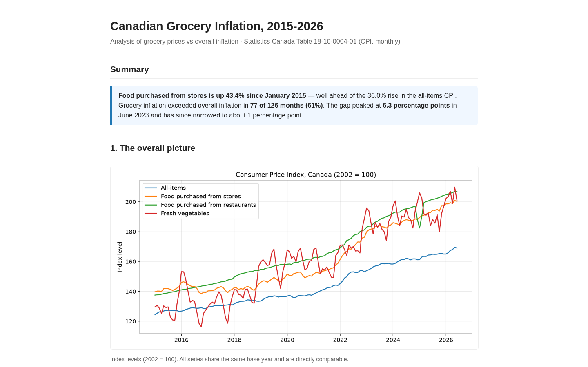

# Canadian Grocery Inflation (2015-2026)

How food prices have moved compared to overall inflation in Canada over the past decade — using official Statistics Canada data.

The finished dashboard is live on GitHub Pages: [docs/dashboard.html](https://richard-ws.github.io/Projects-Portfolio/data/canadian-food-inflation/docs/dashboard.html).

[](https://richard-ws.github.io/Projects-Portfolio/data/canadian-food-inflation/docs/dashboard.html)

## Dataset

- **Source:** Statistics Canada, [Table 18-10-0004-01](https://www150.statcan.gc.ca/t1/tbl1/en/tv.action?pid=1810000401) — Consumer Price Index, monthly, not seasonally adjusted
- **Scope:** Canada, selected product groups, index base **2002=100** (so series are directly comparable), January 2015 – June 2026
- **Raw data:** the full table dump is ~160 MB (all geographies/products/base years) — downloaded to `data/raw/` (gitignored); the processed subset is committed at `data/processed/cpi_canada_food_2015_2026.csv`

## Key findings

| Metric | Value |
|---|---|
| Grocery-store inflation (Jan 2015 → Jun 2026) | **+43.4%** |
| All-items CPI over same period | **+36.0%** |
| Months groceries outran all-items | **77 / 126 (61%)** |
| Widest gap | **6.3 pp** (June 2023) |
| Gap now | ~**1 pp** |
| Regression slope (food vs all-items YoY) | **1.44** (r² = 0.54) |

Grocery prices have structurally outrun the overall basket — and every 1 percentage point of general inflation has come with ~1.4 points of grocery inflation. Fresh vegetables (+55%) were the fastest riser; the 2021–2023 spike drove the gap to its peak.

## Reproduce

```bash
python -m venv .venv && source .venv/bin/activate
pip install -e ".[dev,report]"

# 1. Download the raw table (once)
curl -L -o data/raw/18100004.zip https://www150.statcan.gc.ca/n1/tbl/csv/18100004-eng.zip
unzip -o data/raw/18100004.zip -d data/raw/

# 2. Regenerate the processed dataset
python scripts/make_processed.py

# 3. Run the analysis
python scripts/run_eda.py

# 4. Rebuild charts + dashboard
python scripts/make_charts.py
python scripts/make_dashboard.py

# 5. Tests
pytest
```

## Contents

| Path | What it is |
|---|---|
| `data/processed/cpi_canada_food_2015_2026.csv` | Tidy dataset (date, product, value, yoy) |
| `notebooks/01_food_inflation_eda.ipynb` | EDA notebook (same analysis as `run_eda.py`) |
| `scripts/make_processed.py` | Raw → processed pipeline |
| `scripts/run_eda.py` | Command-line EDA |
| `scripts/make_charts.py` | Chart generation (matplotlib) |
| `scripts/make_dashboard.py` | Self-contained dashboard HTML |
| `docs/dashboard.html` | **The report** — single-file, opens in any browser |
| `docs/charts/` | Standalone PNGs |
| `src/foodinflation/` | Load/clean/analysis library (unit-tested) |

## Notes

- The raw StatsCan file has a UTF-8 BOM; `load_raw` handles it.
- `pandas` is pinned to `>=2.2,<3` because pandas 3.0.5 has a chunked-reader bug that crashes on this large CSV (`IndexError` in `usecols`). Verified locally.
- YoY values are NaN for the first 12 months of each series (no prior-year comparison) — that's the 60 "missing" values reported in the EDA.
