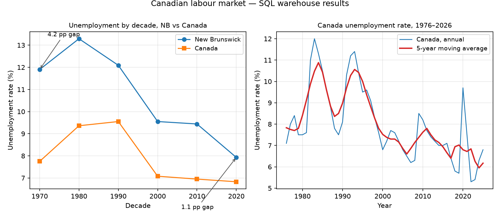

# Canadian Labour Market Analysis

A SQLite data warehouse of Statistics Canada labour-market statistics, with a
repeatable ETL pipeline and a catalog of 14 analytical SQL queries.

**Why this matters:** unemployment and employment rates are headline numbers
behind federal and provincial labour policy. This project takes the raw
long-format CSVs Statistics Canada publishes, normalizes them into a clean
star-schema warehouse, and answers real policy questions in pure SQL — from
"how deep was the 2008 recession dip" to "how far has New Brunswick's
unemployment rate sat above the national average, by decade".

[](docs/results/)

Regenerated from the committed query results by `scripts/make_chart.py`.

## Problem

StatsCan's downloadable tables are long, wide, and inconsistently formatted:
every row carries a geography name, gender label, age group, characteristic
name, unit, and value — with suppressed cells as empty values. Analysts
repeatedly filter, rename, and rejoin the same columns. This project turns
that raw shape into a reusable, queryable warehouse so the analysis step is
pure SQL.

## Approach

- **Data:** Statistics Canada tables
  [14-10-0327-01](https://www150.statcan.gc.ca/t1/tbl1/en/tv.action?pid=14100327)
  (labour force characteristics by province, annual) and
  [17-10-0005-01](https://www150.statcan.gc.ca/t1/tbl1/en/tv.action?pid=17100005)
  (population estimates by age and gender, July 1). Released under the
  [Statistics Canada Open Licence](https://www.statcan.gc.ca/en/reference/licence).
- **Pipeline:** `scripts/download_data.sh` fetches the official CSVs →
  `python -m canlab build` runs a pandas ETL (BOM handling, geography name →
  region code, gender normalization, suppressed-row drop, population filtered
  to joinable age groups) → builds the SQLite warehouse by executing the
  committed schema and view files verbatim.
- **Warehouse:** star schema — `regions`, `age_groups`, `sex` dimensions;
  `labour_force` and `population` fact tables; analytical views
  (`v_unemployment_rate`, `v_employment`, `v_employment_per_capita`,
  `v_part_time_share`).
- **Query catalog:** 14 named queries in `sql/03_analytics.sql`, covering
  window functions (moving average, year-over-year growth), CTEs, pivots,
  decade bucketing, and cross-table joins. Run any of them with
  `python -m canlab query <name>`.

## Results

| Query | Question it answers | Highlights |
|---|---|---|
| `q02_unemployment_by_province_latest` | Which provinces had the highest / lowest unemployment in the latest year? | NL 10.1% vs SK 5.2% |
| `q06_recession_2008_recovery` | How deep was the 2008-09 dip, how long to recover? | Employment fell 1.4% from its 2008 peak, back above it in 2011 |
| `q07_covid_shock_2020` | Which provinces lost and regained the most jobs in 2020-2021? | All provinces down in 2020; five back above their 2019 level by 2021 |
| `q08_nb_vs_canada_unemployment` | How far has NB sat above the national average, by decade? | Gap narrowed from 4.2 pp (1970s) to 1.1 pp (2020s) |
| `q10_employment_per_working_age` | Jobs per 1,000 working-age people, 1976 vs 2025? | Ontario 671 → 761 per 1,000 |
| `q12_youth_unemployment` | Youth vs prime-age unemployment, and has the gap narrowed? | Youth rate ~2× prime-age, gap widens in downturns |

Full outputs for all 14 queries are in [`docs/results/`](docs/results/).

**Validation:** Canada's 2024 annual unemployment rate in the warehouse is
**6.3%**, against the published 6.4% (tolerance-tested in CI).

## Repository layout

```
sql/                  schema, views, and the 14-query analytics catalog
src/canlab/           ETL, warehouse builder, query runner, CLI
configs/example.yaml  table IDs, paths, query list (paths resolve to the project)
data/samples/         committed normalized samples (2020-2025) for a demo build
data/raw/             downloaded StatsCan CSVs — gitignored, reproducible
docs/results/         CSV output of every catalog query on the full dataset
scripts/              download_data.sh, build_database.py, make_chart.py
tests/                59 hermetic tests (fixtures, schema, golden values, all queries)
```

## Getting started

```bash
# 1. Reproduce the data (optional — samples ship in the repo)
scripts/download_data.sh

# 2. Build the warehouse from the committed samples (offline demo)
python -m canlab build --samples

# 3. Or build from the full raw CSVs
python -m canlab build

# 4. Explore
python -m canlab list              # the 14-query catalog
python -m canlab query q08_nb_vs_canada_unemployment
python -m canlab run-all           # dump every query to docs/results/
```

Requires Python 3.10+; install with `pip install -e ".[dev]"`. No API keys,
no secrets — the pipeline hits only public Statistics Canada endpoints.

## Tests

59 hermetic tests (no network): ETL on tiny fixture CSVs, schema and
constraint enforcement, golden values hand-computed from the fixtures, and a
test that every catalog query runs and returns expected rows.

```bash
python -m pytest
```

## Licence

Data © Statistics Canada, used under the
[Statistics Canada Open Licence](https://www.statcan.gc.ca/en/reference/licence).
Code in this project is available for reuse; see the portfolio
[project standards](../../docs/project-standards.md).
