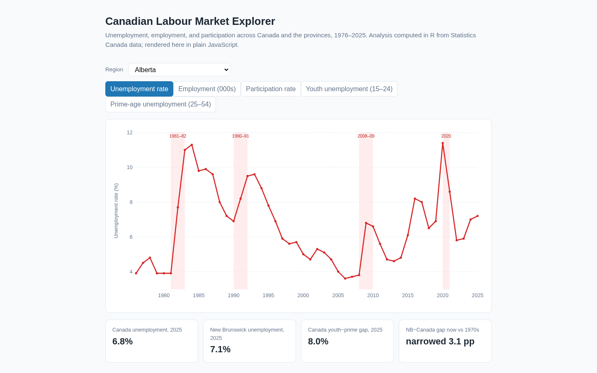

# Canadian Labour Market Explorer

An interactive dashboard of Canadian labour-market statistics, 1976–2025.
**R computes the analysis, plain JavaScript renders it** — no frameworks, no
build step, no external libraries.

**Live demo:** [richard-ws.github.io/Projects-Portfolio/data/canadian-labour-market-explorer/dashboard/](https://richard-ws.github.io/Projects-Portfolio/data/canadian-labour-market-explorer/dashboard/)

[](https://richard-ws.github.io/Projects-Portfolio/data/canadian-labour-market-explorer/dashboard/)

## What it shows

- Unemployment, employment, participation, and youth vs prime-age
  unemployment for Canada and all ten provinces, every year since 1976.
- Recession shading (1981–82, 1990–91, 2008–09, 2020) so downturns are
  visible at a glance.
- The New Brunswick–Canada unemployment gap by decade — the headline story:
  the gap narrowed from **4.2 percentage points in the 1970s to 1.1 points
  in the 2020s**.

## How it works

```
data/samples/labour_market_annual.csv   committed sample (550 rows: 50 years x 11 regions)
        │  R analysis (R/analysis_functions.R + R/analyze.R)
        ▼
docs/results/data.json                  dashboard payload (regions, decades, trends, highlights)
docs/results/charts/*.png               report charts (base R graphics)
        │
        ▼
dashboard/index.html + app.js           interactive SVG chart, zero dependencies
```

The sample CSV was extracted from the project's SQLite warehouse
(`../canadian-labour-market-analysis`), which normalizes Statistics Canada
**Table 14-10-0327-01** (labour force characteristics). The R side performs
the real analysis: decade averages, the NB–Canada gap, youth vs prime-age
gaps, employment indexing, and per-region linear trends, exported as JSON.

## Reproduce

```bash
# Analysis (regenerates docs/results/)
Rscript R/analyze.R

# Tests — R (testthat) + JavaScript (node:test)
bash scripts/test.sh
```

R dependencies are intentionally minimal: **base R + jsonlite + testthat**
(no tidyverse), so the pipeline runs anywhere R is installed.

## Data and licence

Data: Statistics Canada, Table 14-10-0327-01, Labour force characteristics by
province, annual. Used under the
[Statistics Canada Open Licence](https://www.statcan.gc.ca/en/reference/licence).
This is a derivative work; the source tables remain the authoritative record.

## Notes

- Recession intervals are conventional business-cycle markers (1981–82,
  1990–91, 2008–09, 2020), used for visual context only.
- The dashboard loads `docs/results/data.json` at runtime, so it works on
  GitHub Pages or any static file server — no server-side logic.
