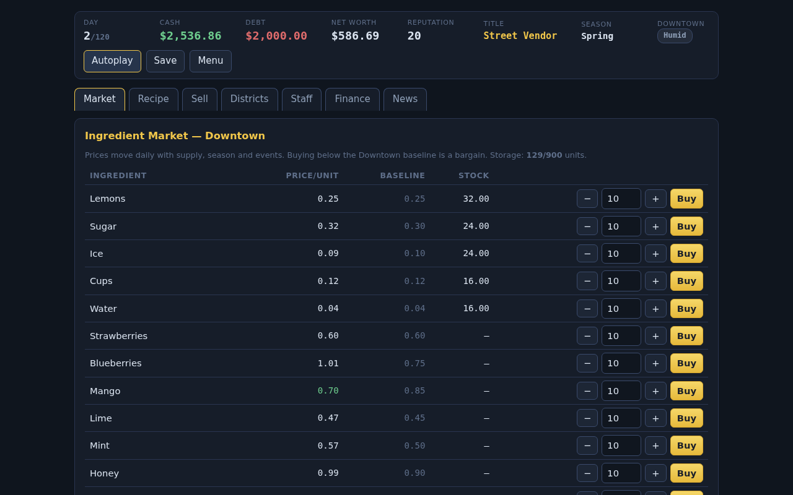

# Lemonade Wars — a beverage-empire business simulation

A single-player business simulation that blends the recipe economics of
*Lemonade Stand* with the travelling commodity markets of *Drug Wars*: you
run a lemonade cart that grows into a beverage empire across ten city
districts. Every decision is a business decision — sourcing, pricing,
production, logistics, staffing, finance, marketing, and risk.

**Play it in your browser:** https://richard-ws.github.io/Projects-Portfolio/experiments/lemonade-wars/
(opens instantly — it's a zero-dependency static page, no frameworks, no
build step, no downloads; works on phones and laptops)

[](https://richard-ws.github.io/Projects-Portfolio/experiments/lemonade-wars/)

## Problem

Classic business-simulation games each nailed one half of the fun. *Lemonade
Stand* made recipe economics tense: cost of goods, batch sizing, spoilage,
weather. *Drug Wars* made markets alive: commodity prices that swing by
location, arbitrage, travel risk, and the nerve to buy low and sell high.
Nothing in between gave you both — a full business where the *product* is
something you design, and the *market* is something you move between.

## Approach

The whole game is a zero-dependency browser app: plain JavaScript modules
over a DOM UI, with the simulation logic ported 1:1 from a tested Python
core that stays in the repo as the behavioral spec.

1. **Simulation core (`js/`, pure logic, no DOM).** A day-cycle engine with
   a deterministic seeded RNG, so every campaign is reproducible and the
   whole game runs headless in CI.
   - **Market** — ten districts, each with its own ingredient prices that
     drift daily and react to supply shocks; price arbitrage pays for
     travelling between districts (the *Drug Wars* half).
   - **Recipe designer** — pick ingredients, sweetness, ice level and
     temperature per product; every choice shifts a flavour vector that
     drives district-level demand (the *Lemonade Stand* half).
   - **Customers** — demand is the product of district demographics, weather,
     season, reputation, advertising awareness, competition, tier capacity
     and technology; sales resolve per-customer with price sensitivity and
     satisfaction (repeat customers).
   - **Business layer** — loans with credit scoring, weekly taxes and
     payroll, insurance against business and crime events, staff hiring with
     morale, equipment and technology unlocks, five business tiers from cart
     to restaurant.
   - **Autoplay** — a scripted greedy player that plays complete campaigns,
     which is also what the smoke tests run headlessly.
2. **Python core (`src/lemonwars/`, reference spec).** The original
   simulation, kept intact and fully tested. It defines every behavior the
   JS port must match — the two suites are checked together in CI.
3. **DOM UI (`js/app.js` + `css/`).** No game loop, no canvas, no render
   thread: the UI re-renders only on player actions, which is what makes
   the app instant to load and impossible to wedge. Save/load uses
   `localStorage`; a seeded "Autoplay" button watches the simulation run.

## Results

- **117 tests green across both suites** (run in CI on a bare runner — no
  display needed):
  - 60 JS tests (`node --test`): data-table invariants, market drift and
    arbitrage, recipe cost/quality, demand and sales resolution, day-cycle
    finance (taxes, interest, insurance, spoilage), bankruptcy and win
    conditions, save/load round-trips (including mid-stream RNG position),
    full-campaign autoplay.
  - 57 Python tests (`pytest`): the reference core — same invariants, same
    green CI.
- The autoplay economy is stable: the scripted player survives 120-day
  campaigns and grows net worth on Normal; bankruptcy (debt ceiling, cash
  floor, or three health-code failures) is a real end state, not a formality.
- Deterministic seeds make every run reproducible — a campaign on seed *N*
  is the same campaign on every platform.
- Loads instantly: ~60 KB of JS and CSS, no network requests at runtime.

## How to run

**Browser (no install):** open the link above.

**Tests:**

```bash
# JS port (Node 18+)
node --test tests/*.test.js

# Python reference core (pytest)
python -m pytest
```

## Project layout

```
lemonade-wars/
├── index.html              # app shell: title → difficulty → game → report → end
├── css/style.css           # dark #0f151e theme
├── js/
│   ├── data.js             # static data: ingredients, districts, weather, …
│   ├── market.js           # per-district ingredient markets
│   ├── world.js            # weather & seasons
│   ├── recipes.js          # recipe designer: usage, flavour, cost, quality
│   ├── customers.js        # demand model + daily sales resolution
│   ├── player.js           # player state, staff, spoilage
│   ├── events.js           # random events + achievements
│   ├── sim.js              # GameState: day cycle, actions, finance, endgame
│   ├── rng.js              # seeded PRNG with save/restore
│   ├── saveload.js         # localStorage save/load
│   ├── autoplay.js         # scripted player for tests & demo
│   └── app.js              # DOM UI: screens, tabs, actions
├── src/lemonwars/          # Python reference core (behavioral spec)
├── tests/                  # 60 JS tests (node:test)
└── docs/screenshot.png     # real render of the running app
```
