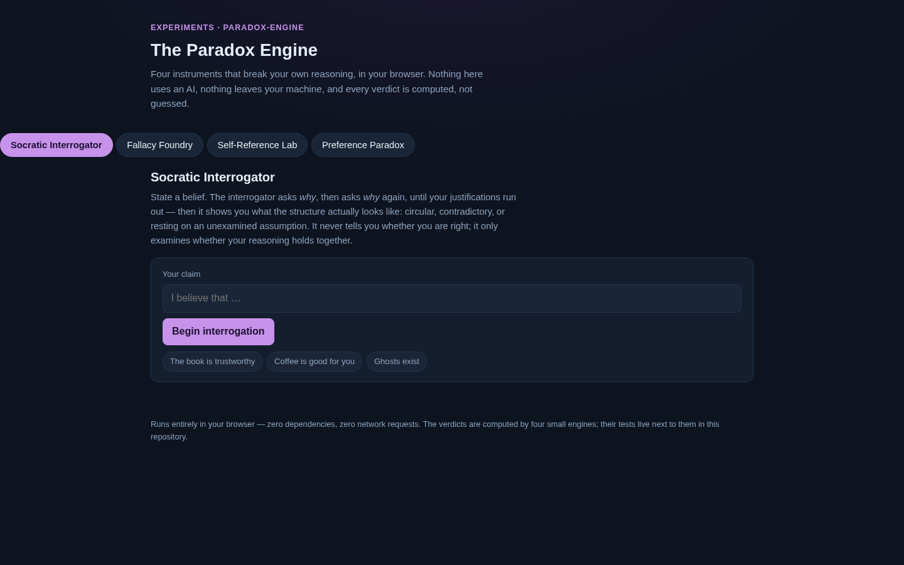

# The Paradox Engine

**Four instruments that break your own reasoning — entirely in your browser.**

Reasoning fails in predictable, repeatable ways: beliefs rest on circular
justifications, arguments borrow the shapes of famous fallacies, some
sentences about truth can never be decided, and your own preferences can
contradict themselves. The Paradox Engine is a museum of those failures —
four interactive instruments, each built around one small, honest algorithm.
No AI, no network, no opinions: every verdict is computed on your machine.

**Live demo:** [richard-ws.github.io/Projects-Portfolio/experiments/paradox-engine/app/](https://richard-ws.github.io/Projects-Portfolio/experiments/paradox-engine/app/)

[](https://richard-ws.github.io/Projects-Portfolio/experiments/paradox-engine/app/)

## The four instruments

| Instrument | What it breaks | How |
|---|---|---|
| **Socratic Interrogator** | Circular and contradictory reasoning | Builds a justification tree from your answers, then flags restatements, contradictions, and unexamined assumptions |
| **Fallacy Foundry** | Fallacious argument shapes | Scans pasted text against a local library of 12 classic fallacy patterns, highlighting the offending spans inline |
| **Self-Reference Lab** | Truth itself | Evaluates systems of sentences that claim truth values about each other, returning TRUE / FALSE / UNGROUNDED / PARADOX per sentence |
| **Preference Paradox Lab** | Your own consistency | Runs a head-to-head tournament on your tastes and reports the Condorcet winner — or the cycles where you contradict yourself |

## How it works

```
app/selfref.js       Self-Reference Lab — Kripke-style fixed-point truth engine
app/fallacies.js     Fallacy Foundry    — 12-pattern heuristic library, span-level flags
app/interrogator.js  Socratic Interrogator — justification trees + structural findings
app/preferences.js   Preference Paradox Lab — round-robin tournament, Condorcet, cycles
app/app.js           browser viewer (tabs, hash routing, shareable #selfref/… URLs)
```

All computation is **pure client-side JavaScript with zero dependencies** — no
build step, no server, no API calls, no AI. The viewer runs on GitHub Pages.
Self-Reference Lab systems are shareable: the sentence list lives in the URL
hash (`…/app/#selfref/…`).

## Reproduce

```bash
# Tests — hermetic golden-value + invariant suite (node:test) + DOM smoke test
bash scripts/test.sh
```

48 golden-value tests pin the four engines' outputs (verdicts, findings,
cycles), and a 22-check stubbed-DOM smoke test drives the full viewer — tabs,
interrogation flow, fallacy highlighting, the liar paradox, and a completed
tournament. The promise "identical inputs, identical verdicts, forever" is
enforced by CI.

## Results

- **Self-Reference Lab** resolves the classic liar ("this sentence is false")
  to **PARADOX**, the truth-teller and grounded chains to consistent verdicts,
  and the near-miss "this sentence is meaningless" to **UNGROUNDED** — the
  strong-Kleene subtlety that most popular treatments gloss over. Oscillating
  systems are detected, not misread as converged.
- **Socratic Interrogator** catches circularity through keyword-overlap
  heuristics: restate your claim in new words and the tree is flagged. It
  deliberately never judges truth — only structure.
- **Preference Paradox Lab** finds Condorcet cycles in real head-to-head data:
  rank three things honestly and it will happily report that you prefer A over
  B, B over C, and C over A.
- **Fallacy Foundry** flags the classic shapes (ad populum, false dilemma,
  slippery slope, ad hominem, straw man, appeal to authority, circular
  reasoning, and five more) with their exact spans highlighted — and says so
  when it finds nothing.

## Novelty notes

A scan of the public landscape (web searches across all four concept areas)
found no exact equivalent to the museum as a whole — and one clear standout:

| Exhibit | Verdict | Closest public equivalent |
|---|---|---|
| Socratic Interrogator | Partial overlap | "Why machine" / Five Whys apps — repeated-why loops, no tree analysis |
| Fallacy Foundry | Partial overlap | yourlogicalfallacyis.com — a static infographic, not a detector |
| Self-Reference Lab | **No direct equivalent found** | Single-paradox explainer pages — one sentence at a time |
| Preference Paradox Lab | Partial overlap | civs.cs.cornell.edu — academic ballot counting, not casual pairwise ranking |

- **Self-Reference Lab is the novelty standout.** Public tools are
  single-paradox explainers (the liar, Yablo's paradox) or theory (Stanford
  Encyclopedia of Philosophy); nothing found lets you build arbitrary networks
  of mutually-referential sentences and run a Kripke fixed-point evaluation
  with TRUE / FALSE / UNGROUNDED / PARADOX verdicts and oscillation detection.
- **Socratic Interrogator:** "why machines" are common (Five Whys prompt
  tools, infinite-why apps), but they are free-form loops — none detect
  circularity, contradictions, or unsupported assumptions in the justification
  tree. The structural-fault detection layer is the differentiator.
- **Fallacy Foundry:** the field splits into static reference posters
  (yourlogicalfallacyis.com, logicallyfallacious.com) and heavyweight academic
  NLP detectors. A purely client-side, heuristic, inline-span-highlighting
  detector appears unclaimed — a packaging win in a well-trodden space rather
  than a new concept.
- **Preference Paradox Lab:** the Condorcet math is textbook and heavily
  implemented (CIVS at civs.cs.cornell.edu, rangevoting.org), but those tools
  count ballots and simulate elections. The casual single-user framing — rank
  your own options, watch your own preferences contradict themselves — is not
  directly covered.
- Honest caveat: only the Self-Reference Lab is conceptually novel. The other
  three repackage well-known ideas with capabilities the existing tools lack.

## Design notes

- **Deterministic everywhere.** Every engine is pure function of its input:
  same sentences → same verdicts, same tournament → same cycles. The golden
  tests freeze this contract.
- **Honest semantics.** The truth engine implements strong Kleene three-valued
  logic with a fixed-point iteration and explicit oscillation detection — the
  same semantics Kripke used for the liar paradox, not a toy approximation.
- **Private by construction.** Text you paste into the Fallacy Foundry never
  leaves the page. Nothing in the app makes a network request.
- **No AI, on purpose.** The whole point is that these failures of reasoning
  are *structural* — they can be detected by small, explainable algorithms.
