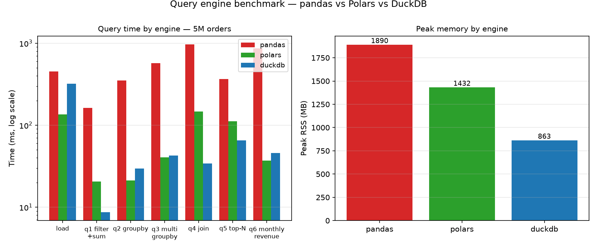

# Query Engine Benchmark

A head-to-head comparison of the three Python analytics engines I reach for
most often — pandas, Polars, and DuckDB — on the same realistic workload: a
multi-million-row retail dataset and six queries that show up in real
reporting work (filters, group-bys, a join, top-N, monthly rollups).

I keep seeing "pandas is slow, use X" takes online, most of them backed by
micro-benchmarks on toy data. This project is my attempt to get honest numbers
on a dataset shaped like the ones I actually query: load time, per-query
timings, and peak memory, with every engine forced to return the *same
answers* before any timing is taken seriously.

## Problem

- pandas is the default, but its performance degrades badly as tables grow;
  Polars and DuckDB are the modern challengers. Each makes different
  trade-offs (expression engine vs. SQL, lazy vs. eager, in-process vs.
  query-plan).
- Benchmarks online are usually single-query micro-tests that don't reflect
  how analytics work is actually written — load the data, filter, group,
  join, sort, roll up.
- "Faster" is meaningless unless the results are the same. Any comparison
  that doesn't verify output equivalence is measuring two different things.

## Approach

1. **Synthetic dataset** (seeded, reproducible): 5,000,000 orders across
   200,000 customers — categories, regions, prices, quantities, dates, and a
   customer table with tiers for the join. Generated chunk-by-chunk so it
   never needs to exist in memory at once; raw files land in `data/raw/`
   (gitignored), a 2,000-row sample is committed under `data/samples/`.
2. **Six representative queries**, each written natively for its engine —
   pandas idioms, Polars expressions, and SQL for DuckDB:
   - `q1_filter_sum` — total revenue, one region
   - `q2_groupby` — revenue by category
   - `q3_multi_groupby` — count / avg price / total qty by region × category
   - `q4_join` — orders × customers, revenue by tier
   - `q5_topn` — top 10 customers by spend
   - `q6_monthly_revenue` — revenue by month
3. **Equivalence gate**: before timing, every engine runs every query on a
   50k-row slice of the real dataset and the outputs are compared pairwise
   (floats within 1e-6). The tests enforce the same guarantee on every run.
4. **Timing**: each engine runs in its own subprocess (so peak memory is
   measured cleanly via `ru_maxrss`), each query times best-of-3 after one
   warmup run, and the median is reported.
5. **Artifacts**: per-engine timings and peak memory in
   `docs/benchmark-results.csv`, the chart in `docs/screenshot.png`
   (`scripts/make_chart.py`), this README's results table, and a summary
   printed to the console.

## Results

Dataset: 5,000,000 orders × 200,000 customers (parquet), best-of-3 median
wall time after one warmup run. Every engine returned identical results on
every query — verified on a 50k-row slice before timing, with the same
equivalence check enforced by the test suite on every run. Machine: single
machine, 10 GB RAM.

| Engine | Load (ms) | q1 | q2 | q3 | q4 | q5 | q6 | Peak mem (MB) |
|---|---|---|---|---|---|---|---|---|
| pandas | 451 | 162 | 352 | 570 | 970 | 365 | 870 | 1,891 |
| Polars | 136 | 21 | 21 | 41 | 146 | 112 | 37 | 1,432 |
| DuckDB | 319 | 9 | 30 | 43 | 34 | 65 | 46 | 863 |

Raw timings: `docs/benchmark-results.csv`.

[](docs/benchmark-results.csv)

The short version:

- **DuckDB was fastest on the filter (q1), the join (q4), and top-N (q5)** —
  and used the least memory overall: 863 MB peak vs pandas' 1,891 MB, about
  2.2× less. A simple SQL aggregate over big tables is exactly what it was
  built for.
- **Polars won the group-bys (q2, q3) and the monthly rollup (q6)**, and
  loaded the parquet files fastest (136 ms vs pandas' 451 ms).
- **pandas was 5–28× slower on every query.** The gap is widest on the join
  (970 ms vs 34 ms) and the monthly rollup (870 ms vs 37 ms) — the operations
  that force it to move data around.
- Loading the data is cheap for all three; the differences are in query
  execution, which is where analytical work actually spends its time.

Caveats, stated plainly: one machine, one synthetic dataset, medians of three
runs. Real workloads mix in user-defined functions, string-heavy data, and
out-of-core cases where the pandas ecosystem and Polars' lazy API change the
picture. The point of this experiment was to replace "I heard X is faster"
with numbers I can reproduce — the config and scripts are committed so anyone
can re-run it on their own data.

## Reproduce

```bash
python -m venv .venv && source .venv/bin/activate
pip install -e '.[dev]'

# 1. Generate the dataset (5M rows, ~200 MB on disk)
python scripts/generate_data.py -c configs/example.yaml

# 2. Verify equivalence + run the benchmark, write docs/benchmark-results.csv
python scripts/run_benchmark.py -c configs/example.yaml

# Smaller/faster runs
python scripts/generate_data.py -c configs/example.yaml --rows 500000
python scripts/run_benchmark.py -c configs/example.yaml --rows 500000

# Tests (hermetic — tiny synthetic data, no network)
python -m pytest -q
```

## Project layout

```
query-engine-benchmark/
├── configs/example.yaml        # all knobs: dataset size, queries, runs
├── data/
│   ├── raw/                    # generated orders/customers (gitignored)
│   └── samples/                # committed 2,000-row samples (seed 42)
├── src/querybench/
│   ├── config.py               # YAML config + numeric-string coercion
│   ├── data.py                 # seeded chunked dataset generator
│   ├── queries.py              # 6 queries x 3 engines + equivalence checks
│   ├── bench.py                # median timing + peak RSS helpers
│   └── runner.py               # per-engine subprocess runner (JSON out)
├── scripts/
│   ├── generate_data.py        # write dataset + samples
│   └── run_benchmark.py        # verify, time all engines, write results
├── docs/benchmark-results.csv  # committed raw results
├── docs/screenshot.png         # chart of the results (scripts/make_chart.py)
└── tests/                      # 64 hermetic tests, incl. cross-engine equality
```
