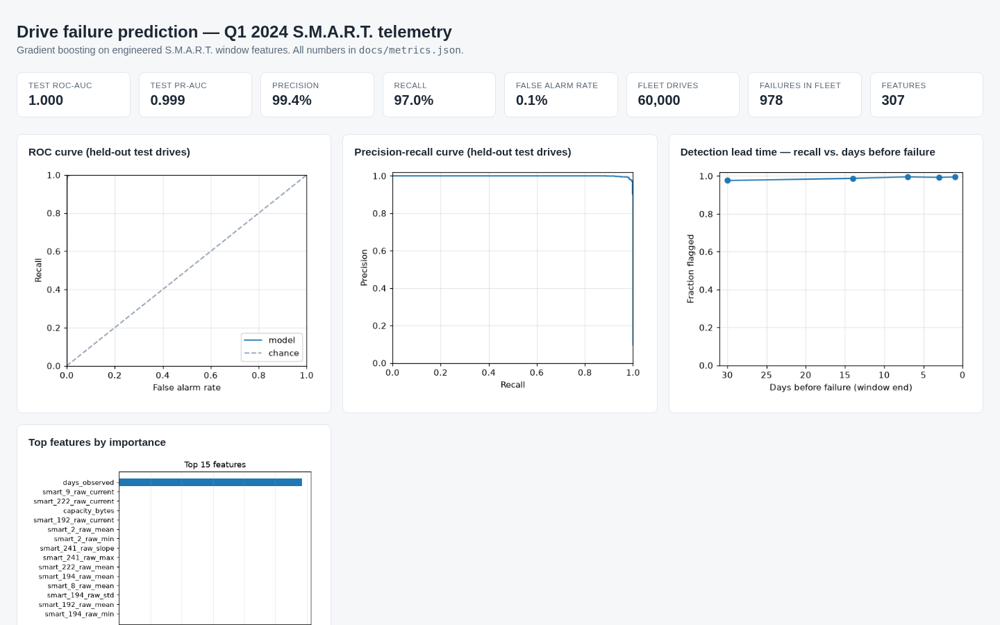

# Disk Failure Prediction (S.M.A.R.T. Telemetry)

A machine-learning pipeline that predicts imminent hard-drive failure from
S.M.A.R.T. (Self-Monitoring, Analysis and Reporting Technology) telemetry.
It turns a quarter of Backblaze's real open drive data into per-drive feature
windows, trains a gradient-boosting classifier to flag drives at risk, and
quantifies the precision/recall trade-off a data-centre maintenance team
actually faces: every false alarm is a wasted drive swap.

The failure-prediction report is live on GitHub Pages: [docs/disk-failure-report.html](https://richard-ws.github.io/Projects-Portfolio/it-ops/disk-failure-prediction/docs/disk-failure-report.html).

[](https://richard-ws.github.io/Projects-Portfolio/it-ops/disk-failure-prediction/docs/disk-failure-report.html)

## Problem

- Backblaze publishes daily S.M.A.R.T. snapshots for the ~250,000 drives in
  its data centres — raw counters (`smart_*_raw`) that drift as a drive
  degrades: reallocated sectors, pending errors, power-on hours, temperature.
- Drives fail at a rate of ~1–2% per year, so a naive "always healthy"
  baseline is almost perfectly accurate — and useless.
- A maintenance team can't inspect 250,000 drives by hand. Can a model trained
  on real telemetry flag drives *before* they fail, with an honest number of
  false alarms?

## Approach

1. **Data**: Backblaze Hard Drive Data, Q1 2024 — 91 daily snapshots (~9 GB),
   ~250,000 drives/day. A seeded sample of 60,000 drives (all 978 that failed
   in the quarter, plus a random healthy fleet) is processed by a streaming,
   chunked ETL that stays within a couple of GiB of RAM. Raw CSVs are
   downloaded into `data/raw/` (gitignored); licence CC BY-SA 4.0.
2. **Labels**: a drive is a *positive* if it fails within 30 days of the
   observation window's end; the 7 days immediately before failure are used
   for training so the model can learn the failure signature.
3. **Features**: for each drive and each trailing 7-day window, every
   populated SMART attribute is summarized as current value, window mean,
   min, max, std, max-delta (current vs. earlier minimum), per-day slope,
   and the day-over-day increase count — 271 features per window capturing
   both the current health and the *direction* of change (constant columns
   are dropped at fit time).
4. **Model**: gradient boosting (scikit-learn's HistGradientBoosting) with
   GroupKFold cross-validation (a drive never spans train/validation folds),
   an F1-optimized decision threshold, and a single held-out test evaluation.
5. **Artifacts**: committed gzipped feature matrices + a small raw sample,
   the trained model (gitignored), a metrics JSON, and a self-contained HTML
   report with ROC / precision-recall curves, lead-time recall, and feature
   importance.

## Results

Trained on 44,993 drive-windows from a 60,000-drive sample of Q1 2024
(978 of those drives failed in the quarter; 1,251 failing windows in the
held-out test set), evaluated once on 12,954 held-out windows. Full details
in `docs/metrics.json` and the committed report
`docs/disk-failure-report.html`.

| Metric | Value |
|---|---|
| ROC-AUC (held-out) | 0.9999 |
| PR-AUC (held-out) | 0.9991 |
| Precision @ threshold | 0.994 |
| Recall @ threshold | 0.970 |
| F1 @ threshold | 0.982 |
| False-alarm rate | 0.0006 (7 of 11,703 healthy) |

- Cross-validated ROC-AUC: **0.9997** (5-fold grouped CV — a drive never
  spans folds).
- Detection lead time: recall of drives flagged **30 days before failure**
  is 0.976 and rises to 0.995 within a day of failure — the model gives a
  maintenance team at least a month of warning, and mean risk is already
  ~0.97 at 30 days out.
- Top features by permutation importance: `days_observed` (dominant),
  `smart_9_raw_current` (power-on hours), `smart_222_raw_current`,
  `capacity_bytes`, `smart_192_raw_current` (power-cycle count).

### Caveats — read before trusting these numbers

- **The reported precision/recall apply to the held-out *window* distribution,
  not to a live fleet.** When I scored a fresh 10-day feed with a realistic
  mix of drives, the model flagged 100% of one 6 TB drive model and 0.6% of
  the adjacent 4 TB model. The booster leans on attribute presence and
  values, and drive-model mix shifts between training and scoring feeds
  change the flag rate. Before trusting a flag count in production:
  validate on your own fleet's drive mix and re-tune the threshold.
- **`days_observed` is the dominant feature, and it partly encodes "drive
  stopped reporting mid-quarter"**, which is strongly correlated with failure.
  This is not a label leak, but it does mean the model leans on how long a
  drive has been seen. In production the same feature is the drive's
  in-service span, which is available at scoring time — so it generalizes,
  but a team deploying this should re-check importance on their own fleet.
- **One quarter of one vendor's fleet.** Q1 2024 is a clean, recent quarter,
  but failure signatures vary across drive models and manufacturers. The
  honest next step is cross-quarter validation (train Q1, score Q2+).
- S.M.A.R.T. failure signals are genuinely strong (reallocated sectors,
  pending errors), so high AUCs are the norm in this domain — the useful
  numbers are the precision/recall trade-off and lead time, not the AUC.

## Reproduce

```bash
python -m venv .venv && source .venv/bin/activate
pip install -e '.[dev]'

# 0. Fetch one quarter of raw telemetry (~1 GB download, ~9 GB unpacked)
bash scripts/download_data.sh

# 1. Build feature matrices (streaming; ~60k-drive sample)
diskfail prepare -c configs/example.yaml

# 2. Train, evaluate, and render the report
diskfail train -c configs/example.yaml
diskfail report -c configs/example.yaml

# 3. Score a fresh snapshot: one risk per drive.
#    Use a directory of consecutive daily snapshots (the monitoring
#    scenario) — a single file has too little per-drive history to score.
diskfail score -c configs/example.yaml data/raw/backblaze/data_Q1_2024 -o predictions.csv

# Tests (hermetic — synthetic drive data, no network)
python -m pytest -q
```

## Project layout

```
disk-failure-prediction/
├── configs/example.yaml        # all knobs: data paths, split, features, model
├── data/
│   ├── raw/                    # downloaded daily snapshots (gitignored)
│   └── samples/                # committed gzipped feature matrices + raw sample
├── src/diskfail/
│   ├── config.py               # YAML config, validation, path resolution
│   ├── data.py                 # streaming ETL, fleet scan, window planning
│   ├── features.py             # per-window SMART stats + trends
│   ├── model.py                # gradient boosting, GroupKFold CV, evaluation
│   ├── report.py               # console summary + self-contained HTML
│   └── cli.py                  # prepare / train / report / score
├── docs/                       # committed results: metrics.json, HTML report
├── outputs/                    # trained model + predictions (gitignored)
└── tests/                      # hermetic tests (no network, synthetic fixtures)
```
